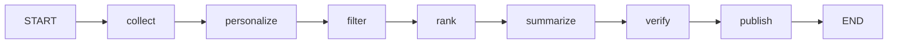

# questail-postie REPORT

게임 라이브러리 기반 개인화 뉴스레터 에이전트 (TypeScript + LangGraph.js + pnpm).
수치·URL은 작업 지시와 저장소 실측(`store/metrics.jsonl`, `scripts/check-select.ts` 실행 결과,
`src/graph.ts`, `audience.yaml`, `output/latest.md`)만 사용. 추정 없음.

## 1. 분야 및 독자 정의

- 분야: 게임 뉴스 개인화 뉴스레터. 수집→선별→한국어 요약→검수→발행 일일 파이프라인.
- 독자: 헤비 게이머, 엄호형 — 본인 Steam 라이브러리·위시리스트 타이틀의 소식을 놓치지 않으려는 독자.
- 관심사: 신작·패치·할인 + 인디 (`audience.yaml`: platforms PC, genres RPG·인디).
- 제외: e스포츠 (`audience.yaml` exclude: e스포츠 — 제목 포함 시 예선 탈락).
- 개인화 단위: `library_appids: [440, 252490]`, `wishlist_appids: [1940340]`.

## 2. 소스 채택표

### 채택 (검증 수치)

| 소스 | 검증 결과 | 비고 |
| --- | --- | --- |
| Steam AppNews API (`https://api.steampowered.com/ISteamNews/GetNewsForApp/v2/`) | 키 불필요. appid 440 2건 호출 성공(수집 스모크), 252490 실측 | 파이프라인 `steam_news_count: 5`/앱 |
| r/Games RSS (`https://www.reddit.com/r/Games/new/.rss`) | 25건 | reddit_feeds |
| PC Gamer RSS (`https://www.pcgamer.com/rss/`) | 50건 | press_feeds |
| VG247 (`https://www.vg247.com/feed`) | 100건 | press_feeds |
| PCGamesN (`https://www.pcgamesn.com/mainrss.xml`) | 75건 | press_feeds |
| GamesIndustry.biz (`https://www.gamesindustry.biz/feed`) | 100건 | press_feeds |
| RPG Site (`https://www.rpgsite.net/feed/`) | 25건 | press_feeds |
| Rock Paper Shotgun RSS | 100건 | 검증済, 파이프라인 미사용 |
| Eurogamer RSS | 100건 | 검증済, 파이프라인 미사용 |
| Gematsu RSS | 20건 | 검증済, 파이프라인 미사용 |
| Kotaku RSS | 20건 | 검증済, 파이프라인 미사용 |

RSS 검증은 `rss-parser`로 파싱, 성공 기준 items 1건 이상. 방문자수 근거(참고):
Polygon 36.11M · GamesRadar+ 16.79M · RPG Site 6.87M · Nintendo Life 약6M ·
Destructoid 5.36M · GamesIndustry.biz 5.23M · PCGamesN 5.17M ·
VG247 약2.3M · Siliconera 1.52M · Shacknews 1.19M (Semrush 2026-06/07, SimilarWeb 병기).

### 탈락

| 소스 | 사유 |
| --- | --- |
| IGN feed URL | 404 |
| r/indiegames·r/GameDeals RSS | 429 (보류, 재시도 없음) |

### 실제 파이프라인 사용 (`audience.yaml` 기준)

- Steam API + Reddit 3종(r/Games·r/indiegames·r/GameDeals — 429 시 해당 피드 0건으로 수집 계속) + 언론 5종(PC Gamer·VG247·PCGamesN·GamesIndustry.biz·RPG Site).
- RPS·Eurogamer·Gematsu·Kotaku는 검증済이나 `audience.yaml` 미포함으로 미사용.

## 3. 선별 로직 설계

흐름: personalize → filter → rank (`src/graph.ts` 노드 순서).

- personalize (`src/personalize.ts` `buildProfile`): Steam Store 메타에서 게임명 인덱스 구축.
  `titleIndex`에 라이브러리·위시리스트 게임명 등록. 항상 개인화 프로필을 반환한다
  (라이브러리·위시리스트 appId, 가중치, recency_hours를 그대로 담음).
  한글명 색인: Store 한글명에서 한글 구간(`[가-힣][가-힣\s]*[가-힣]`, 4자 이상)을 뽑아
  영문 정규명과 함께 `names`에 등록하므로, 한글 제목 기사도 제목 일치 가산 대상이 된다.
- 예선 filter (`src/select.ts` `filterNews`): 제외어(예: e스포츠) 제목 포함 제거 → URL 중복 제거 →
  최신순 정렬 → `batch.pool: 30`건으로 절단.
- 본선 rank (`src/select.ts` `rankFinal`): 점수 = appId 일치 시 전부 가산
  (library `weights.library_match: 3.0` / wishlist `weights.wishlist_match: 2.0`),
  제목 일치 시 절반 가산(`titleMatch: 1.5`, 라이브러리/위시리스트 각각 최대 1회),
  발행이 `recency_hours: 72` 이내면 최신 가산 +1.0. labels는
  `library`/`wishlist`/`library-title`/`wishlist-title`/`recent` 중 해당 항목을 부여하고,
  어느 조건에도 해당하지 않으면 기본 라벨 1개를 부여한다.
  점수 내림차순(동점 시 최신순)으로 `batch.final: 5`건 절단.

`pnpm check:select` 픽스처 결과 (실측, `scripts/check-select.ts`):

```text
profile titleIndex=2 library=440
filter: in=6 out=4
filter ids: steam-440-g1,rss-aaaa,rss-fresh,rss-old
rank final=2
- steam-440-g1 score=4 labels=library+recent title=MGE.tf is back!
- rss-aaaa score=2.5 labels=wishlist-title+recent title=Stardew Valley 1.6 패치 정리
OK check:select
```

예선에서 제외어(rss-excl)·중복(rss-dup) 2건 탈락(6→4),
본선에서 라이브러리 appId+최신(3.0+1.0=4점)이 1위,
위시리스트 제목일치+최신(1.5+1.0=2.5점)이 2위. 설계 의도대로 동작.

## 4. 파이프라인 구조도

`src/graph.ts` 기준 (`@langchain/langgraph` StateGraph, START→…→END 일직선):



- collect: `collectSteamNews`(library+위시리스트 appId, 앱당 5건) + `collectRss`(reddit+press, pool 상한) 병렬,
  `fetchAppMeta`로 게임명·장르 캐시. metrics: `steam=15 rss=30`.
- personalize: `buildProfile` → `library=2 wishlist=1`, titleIndex 3건.
- filter: pool 45건 → 30건.
- rank: 30건 → 최종 5건 (labels 기록).
- summarize: `summarizeItems` — OpenAI 호환 엔드포인트(`OPENAI_BASE_URL`·`OPENAI_API_KEY`·`MODEL`은
  `run.ts`가 `.env`에서 읽어 인자로 전달). 외국어 원문은 한국어 3줄 요약+인사이트 1줄(`translated: true`),
  한국어 원문은 3줄 요약(`translated: false`). 키가 비면 3문장 절취 폴백으로 파이프라인 계속.
  플랫폼·게임명 표기: `fetchAppMeta`가 Store API `platforms`에서 Windows/macOS/Linux를 추출하고
  (`src/collect/steam.ts`), `graph.ts`가 이 메타 맵을 `summarizeItems`에 전달해
  `Summary`에 `gameName`·`platforms`·`sourceName`을 기록한다(폴백·LLM 경로 공통).
  출처 표기: Steam 수집분은 `sourceName: "Steam 공지"`, RSS 수집분은 피드 title(60자 절취)을 `sourceName`으로 둔다.
- verify: `verifySummaries` — 검사 3종(제목 핵심 토큰 포함 / url http+원문 매핑 / 각 200자 이하),
  실패 시 `resummarize` 1회 재생성 후 재검사, 그래도 실패하면 스킵+verdict 기록.
- publish: `publishAll` — 항상 `output/latest.md` 저장, `DISCORD_WEBHOOK_URL`이 있으면 웹훅 전송(2000자 분할).
  md에는 항목마다 게임명·플랫폼 행(`게임: {이름} · {플랫폼/…}`, gameName 없으면 `플랫폼 미상` — RSS분은 appId가 없어
  이 행이 된다)과 출처 행(`- 출처: {사이트} · [원문](url)`)을 둔다.
  Discord 전송문은 `[출처: {사이트}](<url>)` 형식으로, URL을 `<>`로 감싸 임베드 미리보기를 억제한다.
- 기록: 각 노드가 `MetricRecord`를 `store/metrics.jsonl`에 append (`src/run.ts`).

## 5. 실행 기록

`store/metrics.jsonl` 최신 런 실측 (2026-09-15T03:12, 전 구간):

| stage | count | detail |
| --- | --- | --- |
| collect | 45 | steam=15 rss=30 |
| personalize | 3 | library=2 wishlist=1 |
| filter | 30 | pool=45 |
| rank | 5 | labels=recent×5 (해당 런은 최신 가산 5건) |
| summarize | 5 | translated=5 (03:12:29→03:12:38, 약 9초) |
| verify | 5 | 5 pass (재생성 0건) |
| publish | 5 | delivered=true |

- collect 45(steam15+rss30) → personalize → filter 30 → rank 5 →
  summarize translated 5/5(약 9초) → verify 5 pass → publish delivered=true.
- `output/latest.md`: 선정 5건 한국어 요약 저장 확인
  (Aniimo·Arc Raiders·Kingmakers·Wardogs·Level-5 AI 쇼케이스,
  제목+3줄 요약+인사이트+게임·플랫폼+출처+원문 링크 형식.
  현행 파일 기준 5건 모두 RSS분이라 게임 행은 `플랫폼 미상`,
  출처 행은 `출처: newest submissions : indiegames · [원문](…)` /
  `출처: PCGamer latest · [원문](…)` 형태).
- Discord 실전송 확인됨 (해당 런 `delivered=true`).
- 참고: 직전 런들은 `translated=0`(폴백)·`delivered=false`(웹훅 미설정) 상태였으며,
  파일 저장(`output/latest.md`)은 항상 수행.

## 6. 프로젝트 회고

공들인 부분:

- `tsx` + readline 입력 대기 우회: 파이프라인 실행이 프롬프트 대기에 걸리지 않도록
  `src/run.ts`는 `--dry-run`/`--help` 인자 방식으로만 동작하고 대화형 입력을 받지 않는다.
- hang 타임아웃: 수집(RSS·Steam API)과 LLM 호출에 타임아웃을 두고,
  키 미설정·호출 실패 시 절취 폴백으로 파이프라인이 멈추지 않게 했다
  (`summarize.ts` 폴백, `publish.ts` 웹훅 실패 시 파일 저장 유지).
- 개인화 분리: `personalize.ts(buildProfile)`를 선별과 분리해
  프로필 입력(가중치·인덱스)이 바뀌어도 rank 로직을 바꾸지 않는 구조
  (`filterNews`/`rankFinal`은 프로필·가중치를 인자로만 받음).

개선점 (Could):

- SteamID 자동 연동: 현재 라이브러리·위시리스트는 `audience.yaml` 수기 입력.
  `STEAM_API_KEY`·`STEAM_ID`(.env에 자리만 예약, MVP 미사용)로 소유 게임·위시리스트를 자동 동기화하면
  엄호형 독자 정의에 더 부합한다.
- 미출시·e스포츠 제외: e스포츠는 제외어 처리済이나, 미출시작 루머·반복 보도 등
  제외 조건을 `exclude` 키워드 이상으로(예: 출시 상태·중복 주제 클러스터링) 정교화할 여지가 있다.
