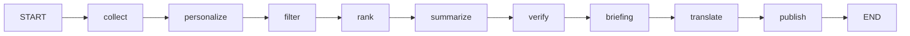
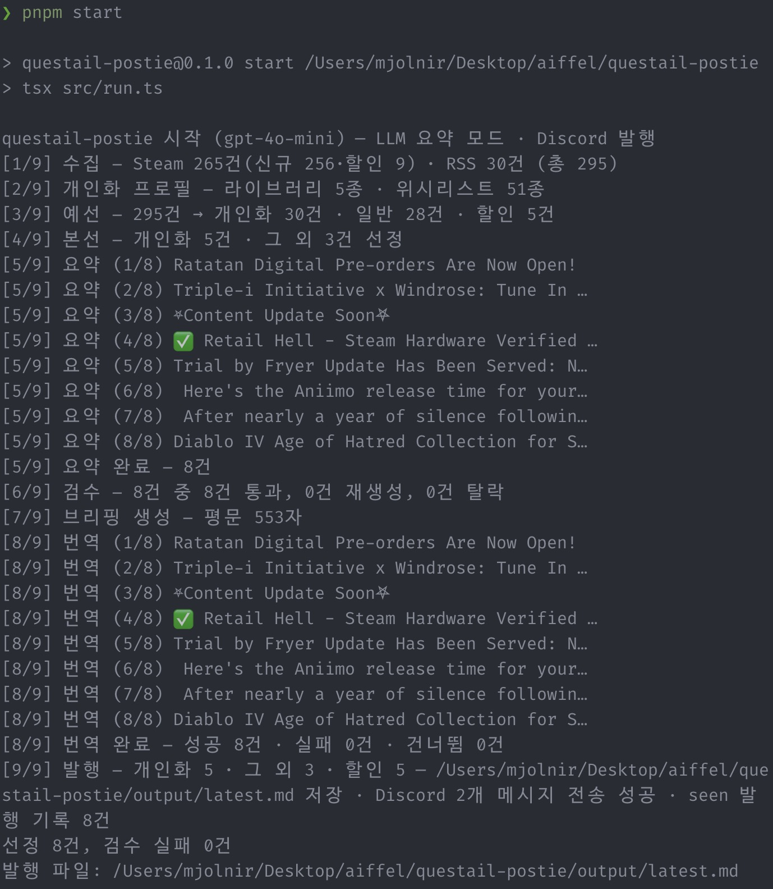
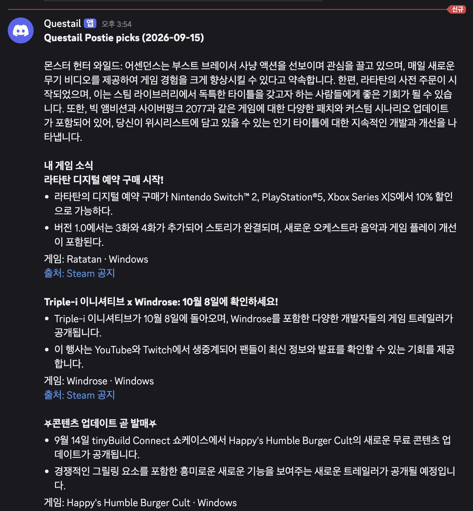

# questail-postie REPORT

게임 라이브러리 기반 개인화 뉴스레터 에이전트 (TypeScript + LangGraph.js + pnpm).
수치·URL은 작업 지시와 저장소 실측(`store/metrics.jsonl`, `scripts/check-select.ts`·`scripts/check-tiers.ts` 실행 결과,
`src/graph.ts`, `src/collect/tiers.ts`, `store/seen.json`, `audience.yaml`, `output/latest.md`)만 사용. 추정 없음.

제출물 구조 (명세 34행 "아래 디렉토리 구조는 예시입니다" — Python 예시에 대한 실제 대응물):

| 명세 예시 | 실물 | 설명 |
| --- | --- | --- |
| `graph.py` | `src/graph.ts` | LangGraph 워크플로우 메인 로직 |
| `run.py` | `src/run.ts` | 파이프라인 실행 스크립트 (`--dry-run`/`--help`) |
| `audience.yaml` | `audience.sample.yaml`(저장소 커밋용) + `audience.yaml`(개인 설정, git 추적 제외) | 타깃·가중치·제외조건·묶음 크기. 개인 게임 목록(appId)은 파일에 적지 않고 SteamID로 런타임에 확정한다 |
| `requirements.txt` | `package.json` (+ `pnpm-lock.yaml`) | 의존성 목록 |
| `store/metrics.jsonl` | 동일 경로 | 파이프라인 실행·검수 기록. 명세가 실행 기록을 제출물로 요구하는데 클론한 사람이 못 받으면 안 되므로 샘플 1회분을 커밋한다 (`.gitignore`에서 제외됨) |
| `REPORT.md` | 동일 | 본 보고서 |
| (명세 외 추가 발행물) `output/latest.md` | 동일 경로 | 발행 산출물. 같은 취지로 커밋 대상이다 (`output/*` 무시 + `!output/latest.md` 예외) |

## 1. 분야 및 독자 정의

- 분야: 게임 뉴스 개인화 뉴스레터. 수집→선별→원어 요약→검수→번역→발행 일일 파이프라인.
- 독자: 헤비 게이머, 엄호형 — 본인 Steam 라이브러리·위시리스트 타이틀의 소식을 놓치지 않으려는 독자.
- 관심사: 신작·패치·할인 + 인디 (`audience.sample.yaml`: platforms PC, genres RPG·인디).
- 제외: e스포츠 (`audience.sample.yaml` exclude: e스포츠 — 제목 포함 시 예선 탈락).
- 개인화 단위: 수기 appId 없음. SteamID 하나로 런타임에 확정한다 —
  실측 보유 120건 · 위시 51건 · 최근 30일 플레이 5건
  (`pnpm check:tiers` live `wishlist=51 recent=5 library=5`, Steam API 직접 조회 `owned=120`).
  보유 수는 무료 플레이 게임 포함 기준 (`include_played_free_games=true`, `src/steamid.ts:96`. 제외 시 116건).
  라이브러리는 최근 플레이 상위 15종(`TIER1_MAX_APPS=15`, `src/collect/tiers.ts:22,62-67`)이다.
  최근 플레이가 없으면 보유 상위 15종으로 폴백한다 (보유 전체 120종 `fetchAppMeta` 폭증 방지).
  실측 live `library=5`는 최근 플레이가 5종뿐이라 5종이 된 것이다. 위시는 전수다 (`src/collect/tiers.ts` `resolveTiers`).

## 2. 소스 채택표

### 채택 (검증 수치)

| 소스 | 검증 결과 | 비고 |
| --- | --- | --- |
| Steam AppNews Tier0 — 위시 전수 (`https://api.steampowered.com/ISteamNews/GetNewsForApp/v2/`) | 위시 51종 × 앱당 5건, 키 불필요 | `TIER0_NEWS_COUNT=5` (`src/collect/tiers.ts`) |
| Steam AppNews Tier1 — 최근 30일 플레이 (`https://api.steampowered.com/ISteamNews/GetNewsForApp/v2/`) | 최근 5종 × 앱당 3건, 키 불필요 | `TIER1_NEWS_COUNT=3`, `TIER1_RECENT_DAYS=30` |
| Steam 할인 감시 (Store `appdetails` `price_overview`) | 정식 런 실측 sale=9 (06:15) | 20%+ 시 `source=steam-sale` 합성. `batch.sale: 5` 상한으로 별도 섹션(`할인 중인 위시리스트`)에 발행한다. 항목은 게임명·할인율·현재가격·링크 한 줄이며 요약 불릿은 없다 |
| r/Games RSS (`https://www.reddit.com/r/Games/new/.rss`) | 25건 | reddit_feeds |
| PC Gamer RSS (`https://www.pcgamer.com/rss/`) | 50건 | press_feeds |
| VG247 (`https://www.vg247.com/feed`) | 100건 | press_feeds |
| PCGamesN (`https://www.pcgamesn.com/mainrss.xml`) | 75건 | press_feeds |
| GamesIndustry.biz (`https://www.gamesindustry.biz/feed`) | 100건 | press_feeds |
| RPG Site (`https://www.rpgsite.net/feed/`) | 25건 | press_feeds |
| Rock Paper Shotgun RSS | 100건 | 검증됨, 파이프라인 미사용 |
| Eurogamer RSS | 100건 | 검증됨, 파이프라인 미사용 |
| Gematsu RSS | 20건 | 검증됨, 파이프라인 미사용 |
| Kotaku RSS | 20건 | 검증됨, 파이프라인 미사용 |

RSS 검증은 `rss-parser`로 파싱, 성공 기준 items 1건 이상. 방문자수 근거(참고):
Polygon 36.11M · GamesRadar+ 16.79M · RPG Site 6.87M · Nintendo Life 약6M ·
Destructoid 5.36M · GamesIndustry.biz 5.23M · PCGamesN 5.17M ·
VG247 약2.3M · Siliconera 1.52M · Shacknews 1.19M (Semrush 2026-06/07, SimilarWeb 병기).

### 탈락

| 소스 | 사유 |
| --- | --- |
| IGN feed URL | 404 |
| r/indiegames·r/GameDeals RSS (429 시) | 탈락이 아니라 0건 허용 — 해당 피드만 건너뛰고 수집은 계속한다 (`src/collect/rss.ts:71`). Reddit 3종은 항상 시도한다 |

### 실제 파이프라인 사용 (런타임 확정 기준)

- Tier0(위시 전수×5) + Tier1(최근 30일×3) + 할인 감시(20%+, `steam-sale` 합성) +
  seen.json 증분(발행분 id만 기록. Steam 수집분 대상, RSS·할인 제외) + RSS 그대로(Reddit 3종 — 429 시 해당 피드 0건으로 수집 계속 + 언론 5종).
- 위시리스트는 `IWishlistService/GetWishlist/v1/`로 전수 조회한다 (`src/steamid.ts`).
  예전 엔드포인트명(`IStoreService/GetWishlist/v1/`)으로 호출하면 404가 나지만, 올바른 이름으로는 정상 동작하며
  실측 51건이다 (`pnpm check:tiers` live `wishlist=51`). appId 수기 관리는 없어졌다 —
  `audience.yaml`에 appId 키가 없고, 전부 SteamID 런타임 확정이다.
- RPS·Eurogamer·Gematsu·Kotaku는 검증됨이나 `audience.sample.yaml` 미포함으로 미사용.

## 3. 선별 로직 설계

흐름: personalize → filter → rank (`src/graph.ts` 노드 순서).

- personalize (`src/personalize.ts` `buildProfile`, 입력은 티어 확정 `effAud`): Steam Store 메타에서 게임명 인덱스 구축.
  `titleIndex`에 라이브러리·위시리스트 게임명 등록. 항상 개인화 프로필을 반환한다
  (라이브러리·위시리스트 appId, 가중치, recency_hours를 그대로 담음).
  06:15 런 기준 `library=5 wishlist=51`, titleIndex 55건.
  filter·rank 로직 자체는 변경 없음(하류 그대로).
  한글명 색인: Store 한글명에서 한글 구간(`[가-힣][가-힣\s]*[가-힣]`, 4자 이상)을 뽑아
  영문 정규명과 함께 `names`에 등록하므로, 한글 제목 기사도 제목 일치 가산 대상이 된다.
- 예선 filter (`src/select.ts` `filterNews`): 제외어(예: e스포츠) 제목 포함 제거 → URL 중복 제거 →
  최신순 정렬 후 세 풀로 분할 — `{sale, personal, general}`을 반환한다 (`src/select.ts:58-62`).
  `sale`(`source==="steam-sale"`)을 먼저 떼어내 개인화 풀에 들어가지 않게 하고 (`select.ts:85`),
  나머지를 `personal`(appId가 라이브러리·위시에 매칭되거나 제목 매칭이 걸리는 항목)과 `general`로 나눈다.
  sale은 `batch.sale: 5`건, personal·general은 각각 `batch.pool: 30`건 상한을 따로 적용하고 (`select.ts:92-96`),
  빈 풀은 다른 풀이 메우지 않는다.
  개인화 소식이 일반 소식 물량에 밀려 사라지지 않게 하기 위해서다.
- 본선 rank (`src/select.ts` `rankFinal`, 풀별로 실행): 점수 = appId 일치 시 전부 가산
  (library `weights.library_match: 3.0` / wishlist `weights.wishlist_match: 2.0`),
  제목 일치 시 절반 가산(`titleMatch: 1.5` — 설정 파일이 아니라 `src/personalize.ts` 하드코딩,
  라이브러리/위시리스트 각각 최대 1회),
  발행이 `recency_hours: 72` 이내면 최신 가산 +1.0.
  여기에 소스 가중치를 합산한다 (`src/select.ts:134-137`) — `audience`의 `source_weights`에서
  url·source 부분일치(최장 키 우선, 미매칭 시 default 1.0)로 값을 찾는다.
  값은 default 1.0 / r/Games 1.2 / indiegames 0.3 / GameDeals 0.5 /
  pcgamer 2.0 / vg247·gamesindustry 1.8 / pcgamesn 1.6 / rpgsite 1.4다.
  등급 라벨을 붙인다 — 1.4 이상 `source:press`, 0.8 이상 `source:community`, 그 외 `source:low`.
  labels는 `library`/`wishlist`/`library-title`/`wishlist-title`/`recent` + `source:등급`이다.
  소스 가중치가 항상 더해져 라벨이 비는 경우가 없으므로, 코드에 남은 `unranked` 폴백(`select.ts:138`)은 실행되지 않는다.
  넣은 이유: 일반 섹션이 최신순으로만 뽑히니 개발자 자가 홍보 글이 언론 기사를 밀어냈다
  ("팝릿 - 필리프 스타일 캐주얼 RPG!" 같은 항목이 실제로 올라옴).
  정식 런에서 extra 3건이 전부 `source:press`로 바뀐 것이 그 실증이다.
  개인화 풀에서 `batch.final: 5`건, 일반 풀에서 `batch.extra: 3`건을 뽑는다
  (점수 내림차순, 동점 시 최신순).
- 묶음 크기 이유 (명세 요구): 수집량이 수백 건대(정식 런 실측 271~280건 — 위시 51종×5가 대부분)라
  사람이 읽고 고를 수 있는 단위로 줄여야 한다. 예선은 풀별 30건 —
  개인화 풀과 일반 풀을 따로 30건으로 잘라 어느 한쪽이 다른 쪽을 밀어내지 못하게 한다.
  본선은 개인화 5건 + 그 외 3건 — 독자 게임 소식이 주인공(5건)이고,
  놓치면 아쉬운 일반 소식을 곁들임(3건)으로 삼는다.
  명세가 말하는 "핵심 뉴스 3~5건"은 개인화 5건이 맡는다. 그 외 3건과 할인 5건은 부가 섹션이다.
  할인은 예선에서 분리된 뒤 본선·요약·검수·번역을 타지 않고 발행으로 직행하는 별도 경로라 핵심 뉴스 계산에 들어가지 않는다.

`pnpm check:select` 실행 결과 (2026-09-15 작업트리 — 종료 코드 1, 순서 단언 실패):

```text
profile titleIndex=3 library=440
filter: in=10 personal=3 general=4 sale=1
personal ids: steam-440-g1,rss-aaaa,rss-ko
general ids: rss-press,rss-promo,rss-fresh,rss-old
sale ids: sale-1940340
rank final=2
- steam-440-g1 score=5 labels=library+recent+source:community title=MGE.tf is back!
- rss-ko score=4.5 labels=wishlist-title+recent+source:press title=엘든 링 DLC 소식 정리
FAIL: second should be the title-match item
```

풀 분할 자체는 의도대로 동작한다 (10건 → personal 3·general 4·sale 1, sale 분리 포함).
다만 본선 순서 단언이 현재 빨간불이다 — 소스 가중치(`source:press`/`source:community` 라벨) 도입 이후
픽스처 기대값과 코드가 어긋나 있다. 정합화 진행 중이라 해설은 여기까지만 적고, 녹색이 되면 다시 인용한다.

## 4. 파이프라인 구조도

`src/graph.ts` 기준 (`@langchain/langgraph` StateGraph, START→…→END 일직선):



상태(State) 흐름 (`src/graph.ts:44-85` `PipelineState`. 노드는 START→END 일직선으로 돌고 아래 칸을 주고받는다):

| 상태 | 쓰는 노드 | 읽는 노드 |
| --- | --- | --- |
| `rawItems` | collect (수집분 전부) | filter (예선 재료) |
| `profile` | personalize (게임명 인덱스) | filter (개인화 판정), rank (점수 가산) |
| `filtered` | filter (personal+general 합침) | rank (풀 재분할 후 본선), briefing (브리핑 재료) |
| `sale` | filter (할인 분리분) | publish (할인 섹션) |
| `finalSel` | rank (개인화 5 + 그 외 3) | summarize (요약 대상) |
| `summaries` | summarize (원어 작성) → verify (통과분으로 교체) → translate (한국어 채움) | publish (발행) |
| `verdicts` | verify (통과·실패·재생성 기록) | `run.ts` (metrics `verdict-fail` 기록용) |
| `digest` (원어 평문) | briefing | translate (번역 재료), publish (발행) |
| `digestKo` (번역문) | translate | publish (발행) |
| `delivered` | publish (전송 성공 여부) | (최종 반환값) |

- collect: `resolveTiers` 확정 → `collectTierSteamNews`(Tier0 위시 전수×5 + Tier1 최근30일×3) +
  `collectRss`(reddit+press, pool 상한) 병렬, `fetchAppMeta`로 게임명·장르 캐시,
  `collectSaleWatch`(위시 20%+ → `steam-sale` 합성) 후
  `loadSeen`→`filterUnseenSteam`으로 걸러내기만 하고, 저장은 publish 성공 후에 한다 (`store/seen.json`, 아래 seen 항목 참조).
  metrics detail 형식: `steam=X(fresh=Y sale=Z) rss=W tier0=A tier1=B tiers=steam|audience`.
- seen (증분 구조, `src/collect/tiers.ts:80-135`): `{published: {itemId: unixSec}}` — 실제 발행한 항목 id만 기록한다.
  바뀐 이유: 기존 앱별 커서는 수집분 전체의 커서를 전진시켜서, 실제 발행은 5건인데 241건이 전부 "봤다"로 기록됐다.
  사용자 런에서 collect `steam=9(fresh=0 sale=9) tier0=241`로 찍혀 개인화 섹션에 Steam 공지가 한 건도 못 올라온 것이 그 결과다.
  지금은 미발행 수집분이 다음 런 후보로 남는다 (실측: 06:22 런 Steam 수집 265건 중 발행 8건만 기록, 257건 후보 유지. RSS 30건 별도).
  기록 시점은 collect 직후가 아니라 publish 성공 후다 (`src/graph.ts:114-115,267-271`).
  하류 실패(파일 쓰기 throw) 시 저장을 건너뛰어 수집분이 영구히 사라지지 않는다 (실패 경로 확인됨).
  Discord 실패(`delivered=false`)여도 파일 저장이 됐으면 기록한다.
  `SEEN_RETENTION_DAYS=30` — saveSeen 때 30일 초과 기록을 정리해 파일이 무한정 자라지 않게 한다 (사용자 요청 "seen 유효기간").
  할인(sale)은 기록하지 않는다 — 가격이 바뀌면 다시 알려야 해서 매번 후보에 둔다.
  한계: 구 형식(apps 커서)은 정확한 변환이 불가능해서 다음 런에서 빈 published로 시작한다.
  첫 1회는 기발행분이 중복 후보가 될 수 있다.
- personalize: `buildProfile(effAud)` → 06:15 런 기준 `library=5 wishlist=51`, titleIndex 55건.
- filter: 수집분을 `{sale, personal, general}` 세 풀로 분할(§3).
  sale은 `sale: 5`건, personal·general은 풀별 pool 30건.
- rank: 풀별로 `rankFinal` — 개인화 `final: 5`건 + 일반 `extra: 3`건 (labels 기록).
- summarize: `summarizeItems` — 원어 요약. 영어 원문은 영어 2~3줄, 한국어 원문은 한국어 2~3줄로 요약하고
  (`src/summarize.ts:89-92,115-128`), 모자라면 제목으로 메운다.
  번역은 여기서 하지 않는다 (translate 노드 담당).
  항목별 인사이트는 두지 않는다. 명세 3단계 "요약 및 인사이트 추출"에는 이렇게 답한다 —
  항목별 요약은 사실 전달에 집중하고, 독자 관점 인사이트는 발행물 선두의 브리핑이 전담한다.
  인사이트를 "뺀" 것이 아니라 항목 단위에서 발행물 단위로 옮긴 것이다.
  항목마다 붙는 한 줄은 뻔한 문장이 되기 쉽고, 전체를 훑고 나서 짚는 편이 독자에게 실제로 쓸모 있다는 판단이다
  (사용자 결정).
  OpenAI 호환 엔드포인트(`OPENAI_BASE_URL`·`OPENAI_API_KEY`·`MODEL`은 `run.ts`가 `.env`에서 읽어 인자로 전달).
  로컬호스트 baseURL(Ollama 등)이면 키 없이도 LLM 요약이 돈다 (`src/llmLocal.ts` `canCallLlm`).
  호출 불가·실패 시 원문 앞부분 절취 폴백으로 파이프라인 계속.
  플랫폼·게임명 표기: `fetchAppMeta`가 Store API `platforms`에서 Windows/macOS/Linux를 추출하고
  (`src/collect/steam.ts`), `graph.ts`가 이 메타 맵을 `summarizeItems`에 전달해
  `Summary`에 `gameName`·`platforms`·`sourceName`을 기록한다(폴백·LLM 경로 공통).
  출처 표기: Steam 수집분은 `sourceName: "Steam 공지"`, 할인 감시분은 `sourceName: "Steam 할인"`,
  RSS 수집분은 피드 title(60자 절취)을 `sourceName`으로 둔다.
- verify: `verifySummaries` — 검사 4종(제목 핵심 토큰 포함 / url http+원문 매핑 /
  길이 — 원어 요약 불릿 300자(`MAX_LINE_CHARS_SRC`) 초과 시 탈락 / 연도·날짜 환각 대조),
  실패 시 `resummarize` 1회 재생성 후 재검사, 그래도 실패하면 스킵+verdict 기록.
  한국어 200자(`MAX_LINE_CHARS_KO`)는 탈락 조건이 아니다 —
  translate 내부에서 초과분을 절단해 수용한다 (`src/translate.ts`, 검증 실패 조건과 분리됨).
  원어로 요약된 상태에서 검사하므로 제목 토큰 대조가 실제로 작동한다.
  번역된 요약 뒤에 검사하면 영어 제목 토큰을 한국어 문장에서 찾을 수 없어 검사가 무력해진다.
  translate를 verify 뒤·발행 직전에 둔 이유다.
  실증이 아니라 관측으로 적는다 (2026-09-15T06:15 정식 런): 연도·날짜 검사가 발동해 재생성 1회를 돌렸고,
  재검사 탈락으로 해당 항목을 발행에서 스킵했다. 대조 범위는 제목+본문이다 (`src/verify.ts:75-78`).
  다만 그 런의 원문을 지금 확인할 수 없어 "환각 검출"로 단정하지는 않는다.
  같은 런 verify 기록은 count=7 (8건 중 7건 통과·1건 스킵):

  ```text
  {"ts":"2026-09-15T06:15:22.450Z","stage":"verdict-fail","count":0,"detail":"rss-7f18b06fb0a5baed:재생성 후에도 실패: 원문에 없는 연도·날짜 표현: 2027 (기존 실패: 원문에 없는 연도·날짜 표현: 2027)"}
  ```
- briefing: `buildDigest` (`src/digest.ts`) — 선별 풀(`filtered`)의 제목 목록을 보고
  평문 1문단(2~3문장) 브리핑. md·Discord 모두 헤더 없이 평문 문단만 들어간다.
  원문이 없거나 호출 실패 시 빈 문자열이라 섹션이 생략된다. metrics stage `digest`.
  이 브리핑이 인사이트 역할을 맡는다. digest 프롬프트는 독자 관점을 직접 지시한다
  (`src/digest.ts:47-55` — heavy gamer 독자 정의, 1~2개 핵심 기사 집중, "독자에게 중요한 것과 이유·후속 행동" 서술).
- translate (신규): `translateToKorean` (`src/translate.ts`) — summaries 불릿과 digest를 발행 직전에 한국어로 번역한다.
  성공 시 `translated: true`. 미번역(원어 그대로) 항목은 발행물에 `(원문 요약)` 표시가 붙는다. metrics stage `translate`.
  검증은 불릿 2~3개 허용 + 원문 개수 일치·URL 미포함·한글 포함 여부를 보고 (`src/translate.ts:69-82`). 200자 초과는 버리지 않고 절단해 수용한다.
  검증에 걸리거나 호출이 실패하면 **1회 재시도**하고, 재시도도 실패한 항목만 원어로 발행한다
  (항목 단위 호출이라 한 건이 실패해도 나머지는 번역된다). 원문이 한국어인 항목은 호출 없이 통과시킨다.
- publish: `publishAll({personal, extra, sale}, opts, digestText)` — 항상 `output/latest.md` 저장,
  `DISCORD_WEBHOOK_URL`이 있으면 전송. 세 섹션 순서대로 개인화(`내 게임 소식`) → 그 외(`그 외 오늘의 소식`) →
  할인(`할인 중인 위시리스트`)이며, 빈 섹션은 `(오늘은 해당 소식이 없습니다)`로 표시한다.
  항목 형식: 제목 + 불릿 2~3개 + 출처 행. 게임명 행(`게임: {이름} · {플랫폼/…}`)은 켜져 있고
  (`output.show_game_line: true`), `gameName`이 있는 항목에만 붙는다 (`src/publish.ts:37-43`).
  Steam 수집분은 Store 메타에서 `gameName`을 기록하고, RSS분은 appId가 없어 `gameName`이 비어 행이 생략된다.
  md 출처 행은 `- 출처: {사이트} · [원문](url)`,
  Discord 전송문은 `[출처: {사이트}](<url>)` 형식으로, URL을 `<>`로 감싸 임베드 미리보기를 억제한다.
  수신 캡처에서 출처가 링크로만 뜨고 미리보기가 없는 것이 이 처리의 실제 증거다 (§5 캡처 참조).
  Discord는 항목별 분할 발송이 아니라 하나로 묶어 보내고, 2000자 초과 시 항목 경계에서 분할한다.
  단 한 항목 통째로 한도를 넘으면 그 항목만 `…(이하 생략)`으로 절단한다 (`src/publish.ts` `truncateBlock`·`TRUNC_MARK`).
- 진행 로그: 실행 중 `[1/9] 수집` … `[9/9] 발행` 9단계가 stdout에 찍힌다 (노드 순서대로).
- 기록: 각 노드가 `MetricRecord`를 `store/metrics.jsonl`에 append (`src/run.ts`).
  `--dry-run`은 수집·선별까지만 보여주고 기록하지 않는다.

## 5. 실행 기록

`store/metrics.jsonl` 읽는 법 (세대차 안내): 이 파일은 207줄 전체를 그대로 커밋한다.
개발 과정 전체가 시간순(02:59→06:54)으로 쌓인 기록이라 폴백 런·검수 탈락·증분 동작 근거가 전부 들어 있다.
다만 seen 구조가 바뀌어서, 최신 런만 현행 코드 기준이다.
05:26·06:15·06:23·06:27 런은 전부 구 커서(앱별 마지막 gid·date) 방식 시절 기록이다.
06:53 정식 런(아래 표)이 현행 구조(발행분 id 집합) 첫 기록이다.
그래서 06:27의 collect `fresh=0` 같은 수치는 "수집분 전체를 봤다고 기록했다"는 구 동작의 결과로 읽어야 한다.
현행 구조(발행분 id만 기록)에서는 같은 상황이 재현되지 않는다 — 미발행 수집분은 다음 런 후보로 남는다.
옛 레코드를 무시하라는 뜻이 아니다. 폴백·검수 근거로서 가치는 그대로다. 세대만 구분해서 읽으면 된다.
저장소의 `store/seen.json`은 새 형식(published)만 남는다 (구 apps 형식 파일은 삭제되고 다음 런부터 새로 생성됨).

`store/metrics.jsonl` 정식 런 실측 (2026-09-15T06:53~06:54.
프로바이더 OpenAI 유료 API, `gpt-4o-mini` — 아래 캡처 첫 줄 확인.
`--dry-run`은 `src/run.ts:127-130`에서 기록 전에 return하므로 metrics를 남기지 않는다):

| stage | count | detail |
| --- | --- | --- |
| collect | 295 | steam=265(fresh=256 sale=9) rss=30 tier0=241 tier1=15 tiers=steam |
| personalize | 55 | library=5 wishlist=51 noMeta=0 |
| filter | 58 | pool=295 personal=30 general=28 sale=5 |
| rank | 8 | personal=5 (wishlist×2 + library×3, 모두 source:community) + extra=3 (recent+source:press ×3) |
| summarize | 8 | sourceKo=0 |
| verify | 8 | 8 pass (재생성 0건) |
| digest | 1 | chars=553 pool=58 |
| translate | 8 | ok=8 ko=0 failed=0 skipped=0 |
| publish | 8 | delivered=true parts=2 sale=5 seen=8ids |

- fresh=256 — 이번 seen 구조 변경의 실증이다. 구 커서 시절 06:27 런은 수집 256건이 전부 "봤다"로 기록돼 fresh=0이었지만,
  현행 구조(발행분 id만 기록)인 이번 런은 미발행분이 후보로 남아 fresh=256이 수집됐다. 세대차 안내와 같은 맥락이다.
- seen=8ids — 수집 295건 중 실제 발행한 8건만 기록했다 (Steam 265건 중 8건 기록·257건 후보 유지. RSS 30건은 별도).
- translate ok=8 failed=0 — 전건 한국어 번역 성공이다.
- verify 8/8 pass, 재생성 0 — 이번 런에서는 환각 탈락이 없었다. 06:15 런의 2027 관측(아래)과 구분된다.
- parts=2 — Discord가 항목 경계에서 2개 메시지로 분할됐다. 분할 발송이 실제로 동작한 기록이다.



위 캡처에 9단계 진행 로그(`[1/9]` 수집 … `[9/9]` 발행)와 발행 결과(선정 8건·검수 실패 0건·발행 파일 경로)가 모두 보인다.
명세 52행 "최종 검수를 거쳐 정상 발행된 결과 화면 캡처" 요구에 이 캡처로 답한다.
터미널 캡처는 파이프라인 실행 증거이고, 아래 Discord 캡처는 목표 채널에 실제로 전달됐다는 증거다. 역할이 다르다.



위 캡처에서 직접 확인한 것만 적는다. 발신자는 Questail 앱(웹훅), 시각 오후 3:54다.
상단에 브리핑 평문이 헤더 없이 먼저 오고(md와 동일), 그 아래 "내 게임 소식" 섹션 헤더가 있다.
항목마다 제목(볼드) + 불릿 + 게임명 행("게임: Ratatan · Windows" — Steam 수집분에만 붙는다) + 출처 링크 순이다.
출처는 링크로 뜨는데 임베드 미리보기가 없다 — URL을 `<>`로 감싼 처리가 실제로 동작한 증거다 (§4 publish 근거).
불릿이 항목당 2개로 나왔다 — 3개 고정이 아니라 2~3개 허용으로 바꾼 결과다.
이 캡처에는 두 번째 메시지나 할인 섹션이 잡혀 있지 않다. 그 부분은 metrics의 `parts=2`·`sale=5`로 뒷받침한다.
명세 5단계 "최종 발행 — 검수를 최종 통과한 콘텐츠가 목표 채널에 문제없이 전달 및 발행되는지 확인"에 이 캡처로 답한다.

`pnpm check:tiers` 실측:

```text
tiers constants: Tier0=5 Tier1=3 recent=30d sale>=20%
seen: in=5 fresh=3 ids=steam-440-101,steam-440-102,steam-252490-1
seen published-set OK (발행분만 제외, 미발행분은 다음 런 후보)
[seen] 구 형식 seen.json(apps 커서)을 발견 — published 빈 집합으로 시작합니다
seen migration OK (구 apps 형식 → 빈 published)
sale threshold OK (19→drop, 20/75→steam-sale)
tiers live: source=steam wishlist=51 recent=5 library=5
OK check-tiers
```

- `output/latest.md` (06:54 덮어씀, 위 정식 런 산출): 한국어 번역 상태 확인.
  브리핑 평문 문단 (헤더 없음) + 내 게임 소식 5건(라타탄·Triple-i·콘텐츠 업데이트·Retail Hell·Trial by Fryer) +
  그 외 3건(Aniimo·킹메이커스·디아블로 IV) + 할인 5종.
  항목마다 제목 + 불릿 + 출처·원문 링크.
- Discord: 위 정식 런 `delivered=true`(metrics 기록). 수신 화면은 위 캡처 참조.
- 환각 검수 관측 (06:15 런 — 위 정식 런과 다른 런): 연도·날짜 검사가 발동해 (`2027` 표현) 재생성 1회를 돌렸고,
  재검사 탈락으로 해당 항목을 스킵했다. verify count=7 (8건 중 7건 통과·1건 스킵). 원문 기록은 §4 검수 항목 참조.
- 주의: `output/latest.md`는 매 실행마다 덮어쓴다. 위 인용은 열람 시점 파일 기준이며 후속 런에 덮어씌워질 수 있다.
- 참고: 티어 적용 전 런(03:41)은 collect 45(steam15+rss30)·personalize library=2였으며,
  그 이전 런들은 `translated=0`(폴백)·`delivered=false`(웹훅 미설정) 상태였고
  파일 저장(`output/latest.md`)은 항상 수행.

### 매일 아침 실행 (스케줄러 — 코드 내장 대신 OS에 거는 방법)

명세 첫 줄 "매일 아침"에 대한 답이다. 스케줄러를 코드에 내장하지 않고 OS 스케줄러에 걸면 된다.
아래는 이 저장소 기준 그대로 동작하는 형태다. 전제: `.env`에 키·웹훅 설정
(없으면 폴백 요약 + 파일 저장만 수행하고 멈추지 않는다).

macOS `launchd` (권장): `~/Library/LaunchAgents/com.questail.postie.plist`

```xml
<?xml version="1.0" encoding="UTF-8"?>
<!DOCTYPE plist PUBLIC "-//Apple//DTD PLIST 1.0//EN" "http://www.apple.com/DTDs/PropertyList-1.0.dtd">
<plist version="1.0">
<dict>
  <key>Label</key>
  <string>com.questail.postie</string>
  <key>ProgramArguments</key>
  <array>
    <string>/bin/zsh</string>
    <string>-lc</string>
    <string>cd /Users/mjolnir/Desktop/aiffel/questail-postie && pnpm start</string>
  </array>
  <key>WorkingDirectory</key>
  <string>/Users/mjolnir/Desktop/aiffel/questail-postie</string>
  <key>StartCalendarInterval</key>
  <dict>
    <key>Hour</key>
    <integer>7</integer>
    <key>Minute</key>
    <integer>0</integer>
  </dict>
  <key>StandardOutPath</key>
  <string>/Users/mjolnir/Desktop/aiffel/questail-postie/store/scheduler.log</string>
  <key>StandardErrorPath</key>
  <string>/Users/mjolnir/Desktop/aiffel/questail-postie/store/scheduler.err.log</string>
</dict>
</plist>
```

등록: `launchctl load ~/Library/LaunchAgents/com.questail.postie.plist`.
`zsh -lc`는 로그인 셸 PATH에서 pnpm을 찾는다 (실측 경로 `/Users/mjolnir/Library/pnpm/pnpm`).
PATH에 없으면 `pnpm start`를 절대경로로 교체한다.

크론 대안 (매일 07:00):

```sh
0 7 * * * cd /Users/mjolnir/Desktop/aiffel/questail-postie && /Users/mjolnir/Library/pnpm/pnpm start >> store/scheduler.log 2>&1
```

## 6. 프로젝트 회고

공들인 부분:

- `tsx` + readline 입력 대기 우회: 파이프라인 실행이 프롬프트 대기에 걸리지 않도록
  `src/run.ts`는 `--dry-run`/`--help` 인자 방식으로만 동작하고 대화형 입력을 받지 않는다.
- hang 타임아웃: 수집(RSS·Steam API)과 LLM 호출에 타임아웃을 두고,
  키 미설정·호출 실패 시 절취 폴백으로 파이프라인이 멈추지 않게 했다
  (`summarize.ts` 폴백, `publish.ts` 웹훅 실패 시 파일 저장 유지).
- 개인화 분리: `personalize.ts(buildProfile)`를 선별과 분리해
  프로필 입력(가중치·인덱스)이 바뀌어도 rank 로직을 바꾸지 않는 구조
  (`filterNews`/`rankFinal`은 프로필·가중치를 인자로만 받음).

개선점 (Could):

- SteamID 런타임 확정됨: `resolveTiers`(`src/collect/tiers.ts`)가
  `STEAM_API_KEY`·`STEAM_ID`(전역 `~/.config/questail/.env` 읽기 전용, `src/globalConfig.ts`)로
  보유·위시·최근 플레이를 확정한다. 키가 없으면 빈 티어로 RSS만으로 계속 돈다.
  위시 API 오진도 해소됨 — `IWishlistService`가 정상 동작한다 (실측 51건).
- 미출시·e스포츠 제외: e스포츠는 제외어 처리됨이나, 미출시작 루머·반복 보도 등
  제외 조건을 `exclude` 키워드 이상으로(예: 출시 상태·중복 주제 클러스터링) 정교화할 여지가 있다.
